# Inkscape2Forza

  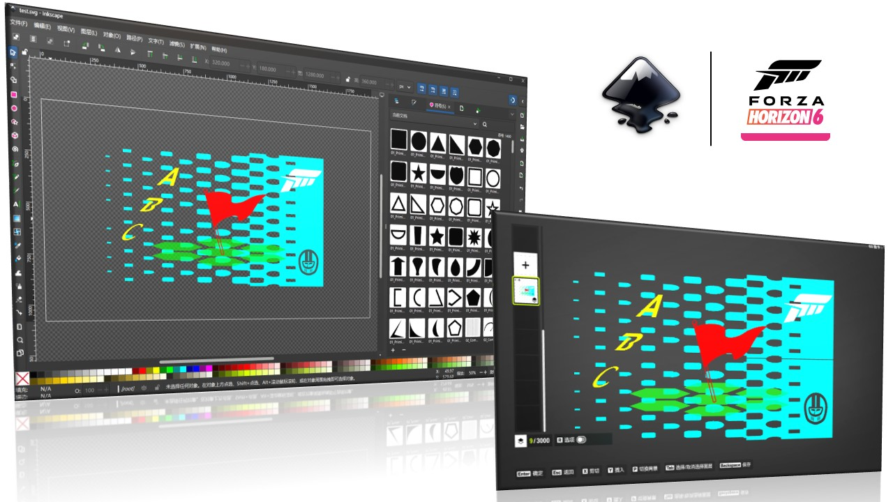

  使用 Inkscape 编辑《极限竞速：地平线 6》彩绘纹饰分组，并在 SVG 与 FH6 存档之间导入、导出。

> A Windows GUI tool for editing Forza Horizon 6 vinyl groups with Inkscape. This README is primarily written for Chinese users; see [English overview](#english-overview) for a short introduction.

Inkscape2Forza 是一款独立的辅助工具，不是 Inkscape 扩展。它提供完整的 FH6 基础图形库，将 Inkscape 中的符号、变换、分组、颜色、透明度和蒙版转换为游戏能够读取的彩绘纹饰分组。

- 项目主页：<https://github.com/F3ankk/Inkscape2Forza>
- 最新版本：[GitHub Releases](https://github.com/F3ankk/Inkscape2Forza/releases/latest)
- 完整图文教程：[Bilibili 专栏](https://www.bilibili.com/opus/1236139150313259015)

## 功能

- 内置 FH6 全部 1400 个基础图形，可安装为 Inkscape 符号库。
- 将 Inkscape SVG 写入玩家自建的 FH6 彩绘纹饰分组。
- 将玩家自建的彩绘纹饰分组导出为可继续编辑和分享的 SVG。
- 支持颜色、透明度、平移、缩放、旋转、倾斜、镜像、图层顺序和嵌套分组。
- 使用 `mask_indicator_dark` / `mask_indicator_light` 图案标记游戏蒙版。
- 将 Geometrize 或 Vinylizer JSON 转换为 SVG。
- 支持多存档账户，尽可能显示本机 Xbox Gamertag；无法解析时回退到 XUID。
- 可将当前账户存档备份为 ZIP。

## 开始前请注意

> [!WARNING]
> 本工具会直接修改本地游戏存档。使用前建议先点击“备份当前账户存档”，并确认左上角选中的账户正确。写入时请至少退出游戏内的彩绘纹饰分组编辑器；为避免云存档冲突，建议直接退出游戏。

- 当前仅支持 **Forza Horizon 6 的 `C_group` 彩绘纹饰分组**，不处理整车涂装 `C_livery`。
- 工具只列出本地自建的 `LayerGroup_0000_*` 分组，不列出下载得到的 UUID 分组。
- 请尊重其他作者的作品。需要使用他人的分组时，应由原作者本人导出 SVG 并授权分享。
- FH6 单个彩绘纹饰分组最多支持 **3000 层**。
- 修改存档可能违反游戏或平台条款，并可能造成存档或账号风险。使用者需自行承担后果。

## 环境要求

- Windows 10/11
- Microsoft Store / Xbox App 版 Forza Horizon 6，并能在本机找到 PGS 存档
- [Inkscape](https://inkscape.org/) **1.4.4 或更高版本**

如果打不开 Inkscape 官网，可尝试 [CERNET 镜像](https://mirrors.cernet.edu.cn/app/inkscape)。如果你只想导入别人提供的成品 SVG，或者从存档导出 SVG，可以不安装 Inkscape。

## 快速上手

### 1. 下载并备份

从 [Releases](https://github.com/F3ankk/Inkscape2Forza/releases/latest) 下载最新版 EXE，启动后检查左上角的“当前账户”，然后点击“备份当前账户存档”。备份文件默认命名为 `backup_<XUID>_<timestamp>.zip`，保存位置由你选择。

  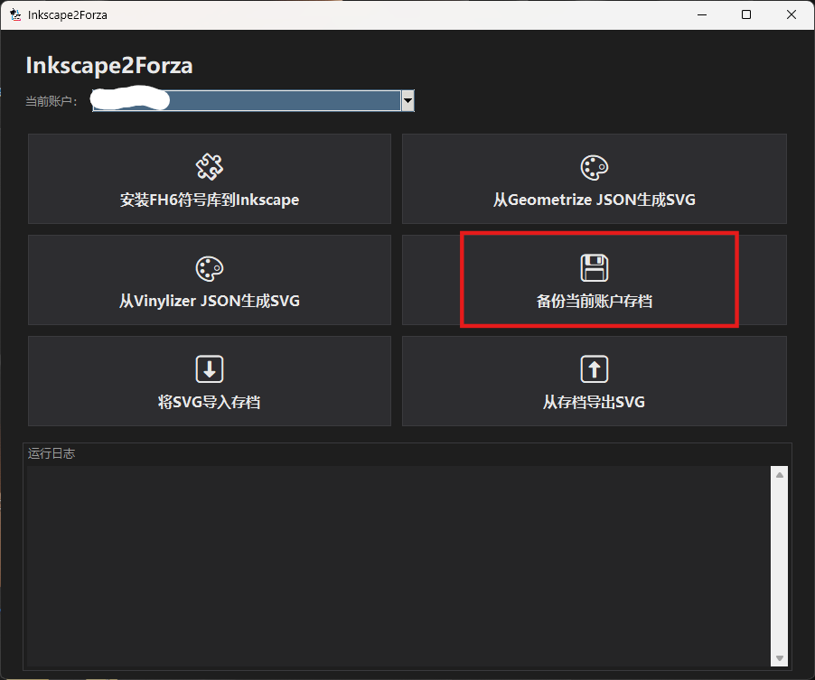

### 2. 安装 FH6 素材库

先安装并至少启动一次 Inkscape，让它生成用户配置目录。随后点击“安装 FH6 符号库到 Inkscape”。完成后重启 Inkscape，或者重新打开“符号”和“填充与描边”面板。

  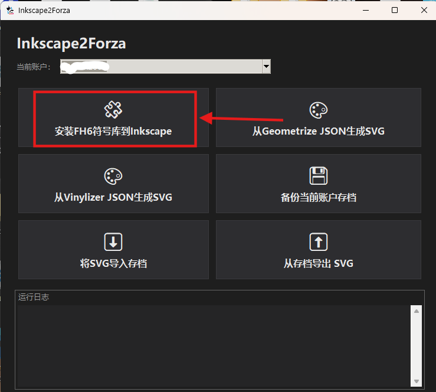

安装成功后，符号面板中会出现 1400 个 FH6 图形，图案列表中会出现两种蒙版指示图案。

  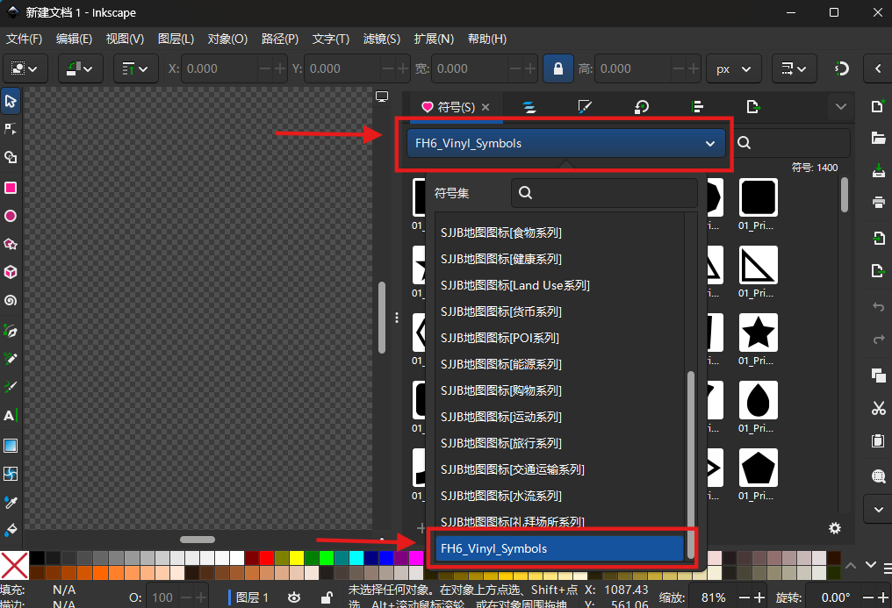

如果符号缩略图没有加载，点击符号面板右下角的齿轮，稍微调整一次“平铺大小”以刷新缓存。

### 3. 在 Inkscape 中绘制

新建文档，建议将画布设为 `1920 × 1080`，与游戏坐标空间保持一致。其他画布尺寸也能转换，但可能出现额外留边或不理想的缩放。

从“符号”面板将 FH6 图形拖入画布，然后进行着色、缩放、旋转、倾斜、镜像、复制和排序。Inkscape 的“组合”会保留为游戏中的分组。

  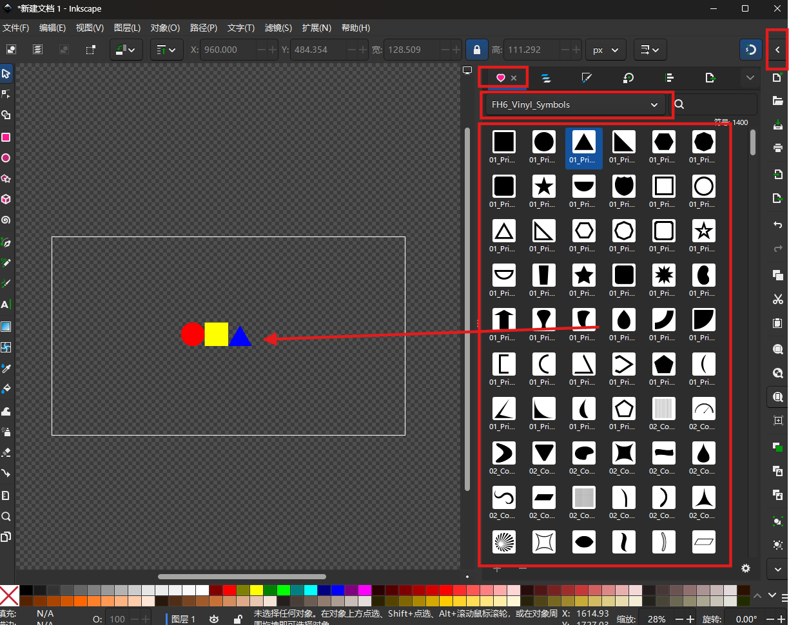

建议删除新文档中自动创建的空白“图层 1”，直接在文档根节点绘制；确实需要层级结构时使用普通组合。

可以将 PNG/JPG 拖入画布并锁定在底层作为临摹参考。位图、文字和其他非 FH6 符号元素不会写入存档。

  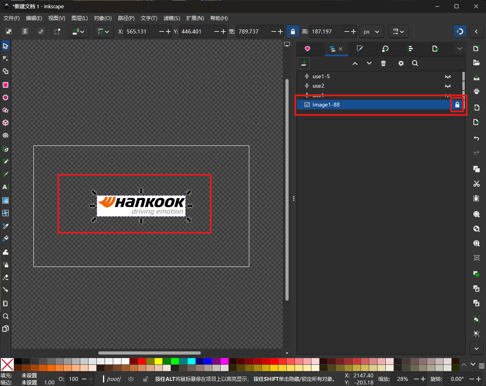

### 4. 在游戏中创建占位分组

在 FH6 彩绘纹饰分组编辑器中创建一个分组，放入至少两个任意图形并保存。给它取一个容易辨认的名字，将共享设置保持为“私密”，然后退出分组编辑器。

占位分组的图形、颜色和层数不需要与 SVG 相同，导入时内容会被整体替换。

  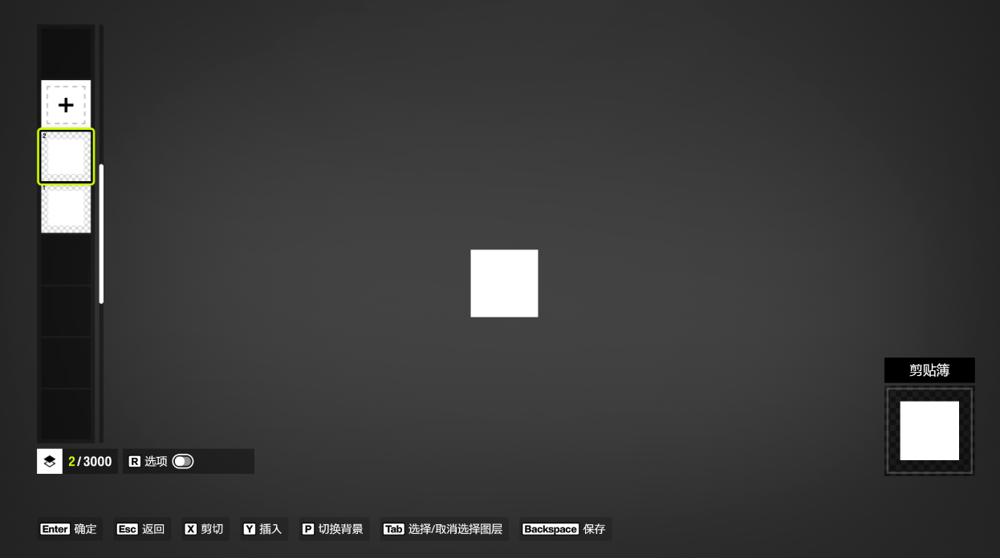

### 5. 将 SVG 导入存档

1. 在左上角确认“当前账户”。
2. 点击“将 SVG 导入存档”。
3. 选择刚才保存的 SVG。
4. 从带缩略图的列表中选择占位分组。
5. 确认覆盖。

  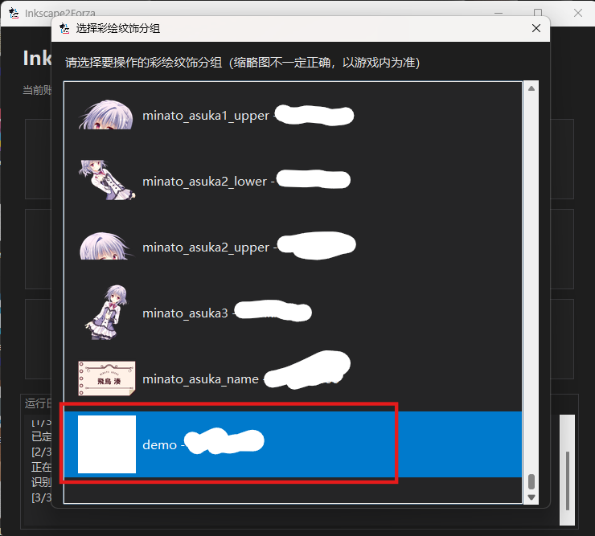

导入完成后回到游戏，打开该分组并再次覆盖保存。游戏需要这一步刷新缓存和缩略图。

  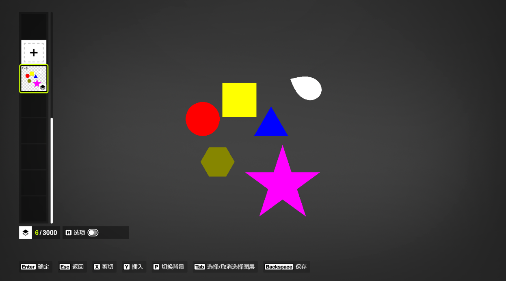

## SVG 编辑规则

### 支持

- FH6 符号库中的图形
- 纯色填充
- 图层或对象透明度
- 平移、缩放、旋转、倾斜和镜像
- 复制、排序和普通组合
- `mask_indicator_dark` / `mask_indicator_light` 蒙版图案

透明度会按 SVG 的实际显示结果合并：颜色 Alpha、填充透明度、对象透明度和父组合透明度会相乘。最终完全透明的图层不会写入存档。

### 不支持

- 使用路径工具改变符号拓扑
- FH6 符号库以外的新矢量图形
- 描边、渐变或任意纹理填充
- SVG 滤镜、剪切路径等复杂效果

无法识别的元素通常会被忽略，因此 SVG 预览可能与游戏内结果不同。导入前请留意程序显示的“识别元素数”和“有效图层数”。

### 蒙版

选中符号，在“填充与描边”中选择“图案”，再应用 `mask_indicator_dark` 或 `mask_indicator_light`。两种图案的含义相同，只是为了在不同画布背景下更容易观察。

  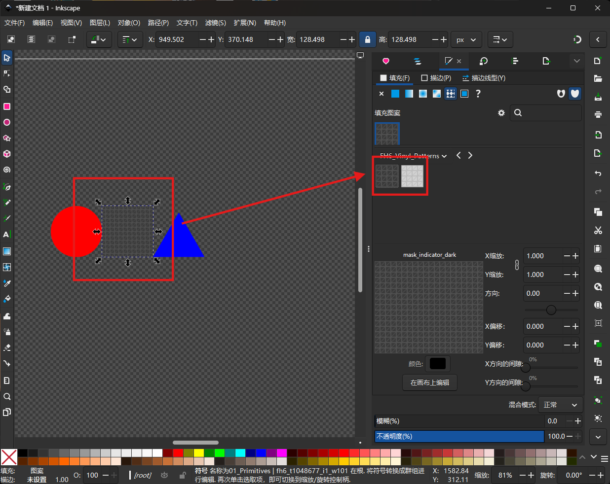

不要使用其他图案。蒙版仍可调整对象透明度，以获得半透明擦除效果。

## 从 Geometrize / Vinylizer JSON 生成 SVG

程序可以读取以下项目导出的 JSON：

- [forza-painter-fh6 / Geometrize GPU](https://github.com/zjl88858/forza-painter-geometrize-gpu)
- [Vinylizer](https://github.com/Heavenchaos/vinylizer)

选择对应的 JSON 转换卡片，载入 JSON 后保存 SVG。生成的 SVG 可以继续在 Inkscape 中编辑，也可以直接导入游戏。

Vinylizer 有时会产生完全透明的无效图层，因此转换时需要设置“不透明度阈值”：

- 图层 Alpha **小于等于阈值**时会被忽略。
- 阈值为 `0` 时仍会过滤完全透明图层。
- 不确定时保持 `0`；提高阈值可能损失半透明细节，而且通常节省不了多少图层。

  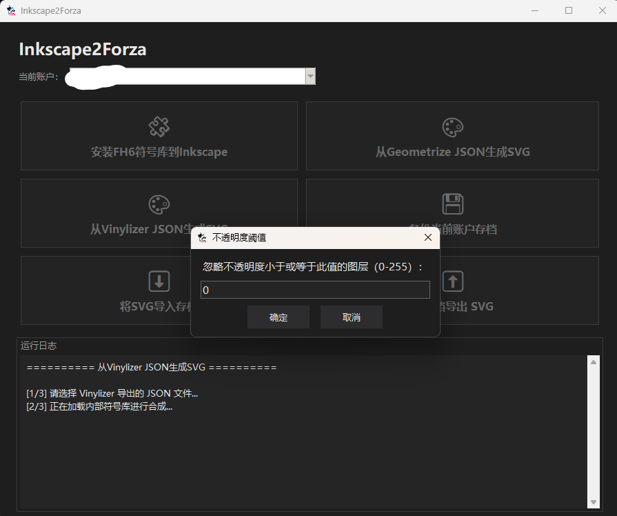

超过 2000 层的 SVG 在 Inkscape 中打开时可能短暂卡顿，请耐心等待。

  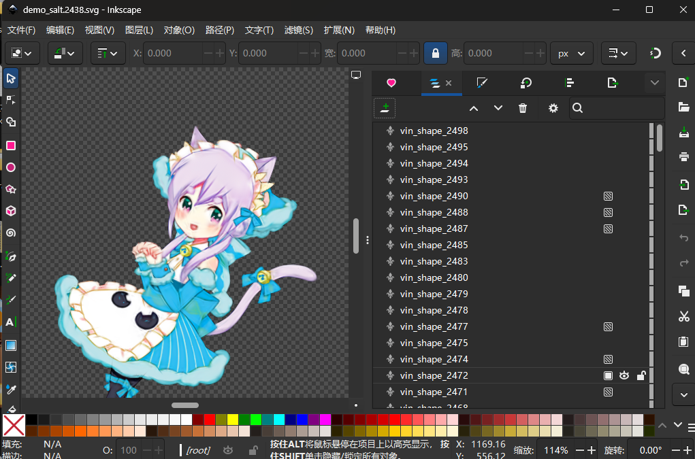

## 从存档导出 SVG

点击“从存档导出 SVG”，选择自己的彩绘纹饰分组和保存位置即可。导出的 SVG 会嵌入实际使用的符号和蒙版图案，可以独立打开、继续编辑或分享。

程序只列出 `LayerGroup_0000_*` 自建分组，不会导出从其他作者处下载的 UUID 分组。

  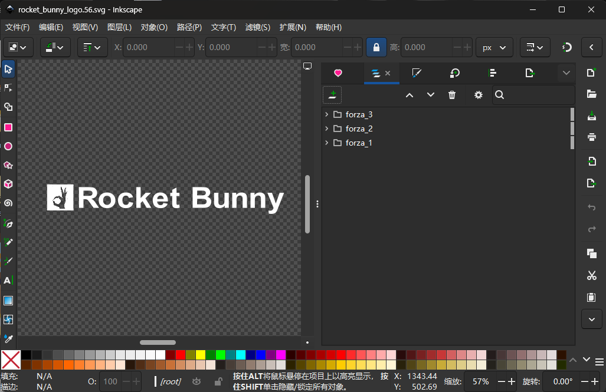

## 存档写入与云同步

写入时仅修改目标 `C_group` 的图层数据，以及 `header` 中的图层数量。标题、描述、作者等游戏业务元数据保持不变。

在 Windows 文件层面，程序会保持原文件的文件 ID、DACL 权限、创建时间、访问时间、修改时间和文件属性；读取列表或导出时也会避免改变访问时间。文件内容实际发生变化后，NTFS 变更日志和云同步仍可能检测到修改，这是正常且必要的行为。

为降低冲突风险：

1. 写入前备份当前账户。
2. 确认没有选错 Xbox 账户。
3. 退出游戏内分组编辑器，最好直接退出游戏。
4. 写入后重新进入游戏，打开并保存一次目标分组。
5. 如果 Xbox 应用提示本地和云端存档冲突，请仔细核对时间和内容后再选择。

## 常见问题

### 找不到存档账户

程序默认搜索 `C:\XboxGames\GameSave`。如果该目录不存在或结构无效，会让你手动选择 GameSave 目录。

### 账户栏只有一串数字

程序会尝试从本机 Xbox 登录信息中用 XUID 匹配 Gamertag。没有找到对应资料时显示 XUID，这是正常回退行为，不影响存档操作。

### 符号面板很卡或没有缩略图

1400 个符号首次加载需要时间。若缩略图为空，在符号面板设置中调整一次“平铺大小”。

### 导入成功但游戏缩略图没变

打开目标分组并在游戏内覆盖保存一次，缩略图才会重新生成。

### 游戏内缺少部分图层

检查这些对象是否确实来自 FH6 符号库，是否使用了路径、描边、渐变或未知图案，并查看导入日志中的有效图层数量。

## 致谢

- [forza-painter-fh6](https://github.com/bvzrays/forza-painter-fh6) 及其开发者：原始贴图矢量/顶点数据、素材库生成和图像拟合研究。
- [forza-painter geometrize GPU Version](https://github.com/zjl88858/forza-painter-geometrize-gpu)：Geometrize 工作流。
- [Vinylizer](https://github.com/Heavenchaos/vinylizer)：Vinylizer 图像拟合工作流。
- @Natsu_Yuk1：GUI 适配工作。
- QQ 群 426913532 的测试成员。

如遇到问题，欢迎提交 [GitHub Issue](https://github.com/F3ankk/Inkscape2Forza/issues)，或在 [Bilibili 图文教程](https://www.bilibili.com/opus/1236139150313259015)下留言。

## English overview

Inkscape2Forza is a Windows GUI tool that converts supported Inkscape SVG documents to Forza Horizon 6 `C_group` vinyl groups and exports user-created groups back to editable SVG.

Quick workflow:

1. Download the latest executable from [Releases](https://github.com/F3ankk/Inkscape2Forza/releases/latest).
2. Select the correct Xbox save account and create a backup.
3. Install the bundled FH6 symbol library into Inkscape.
4. Create a `1920 × 1080` SVG using only the supplied FH6 symbols.
5. Create a private placeholder vinyl group in FH6 and leave the in-game editor.
6. Import the SVG into that group, then reopen and save it once in FH6 to refresh its cache and thumbnail.

The tool supports solid colors, opacity, transforms, mirrors, skew, nested groups and mask patterns. Unsupported SVG objects are ignored. It only lists locally created `LayerGroup_0000_*` groups and does not export downloaded UUID groups.

See the Chinese guide above or the [illustrated Bilibili tutorial](https://www.bilibili.com/opus/1236139150313259015) for detailed instructions.

## License

See [LICENSE](LICENSE).
